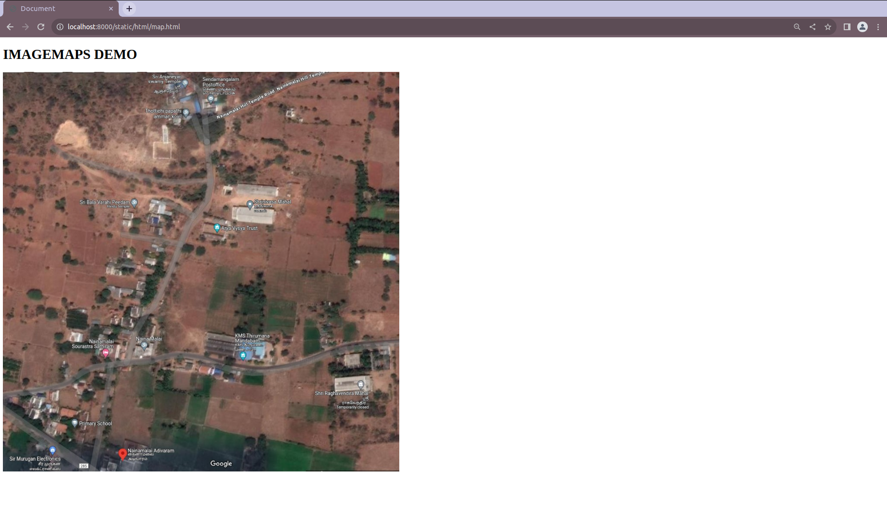
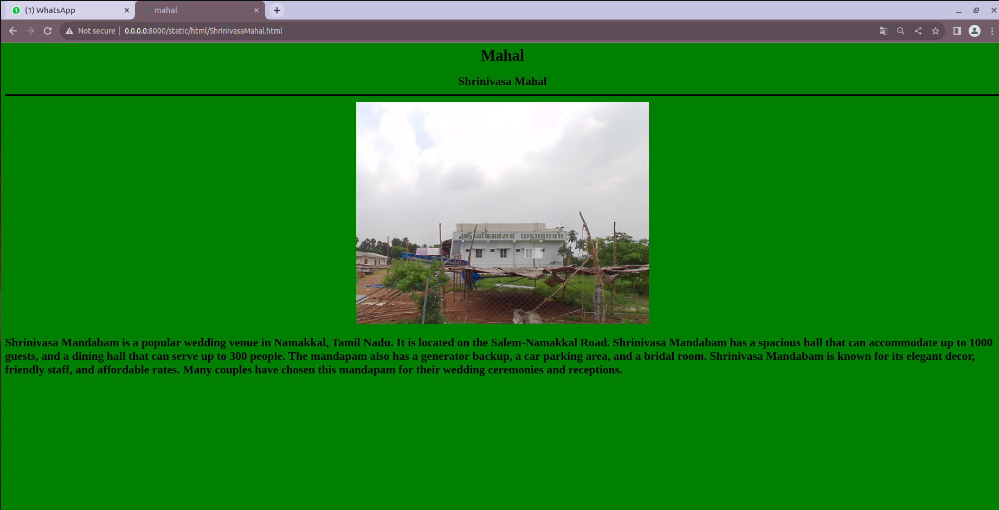
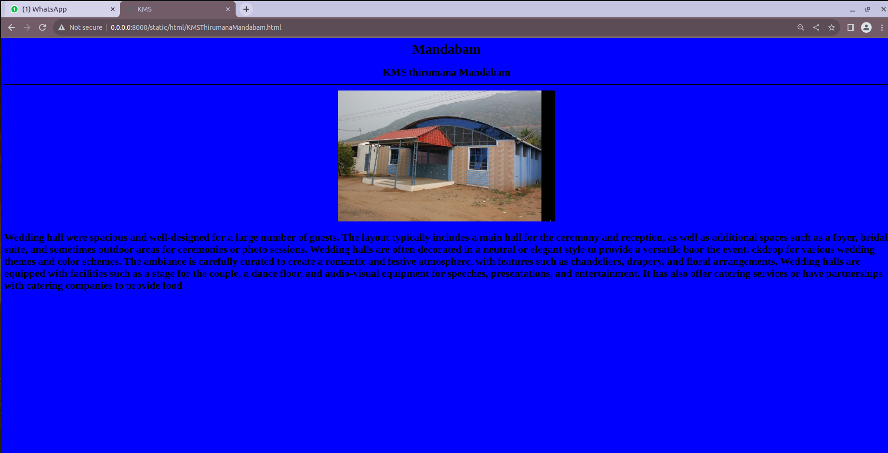
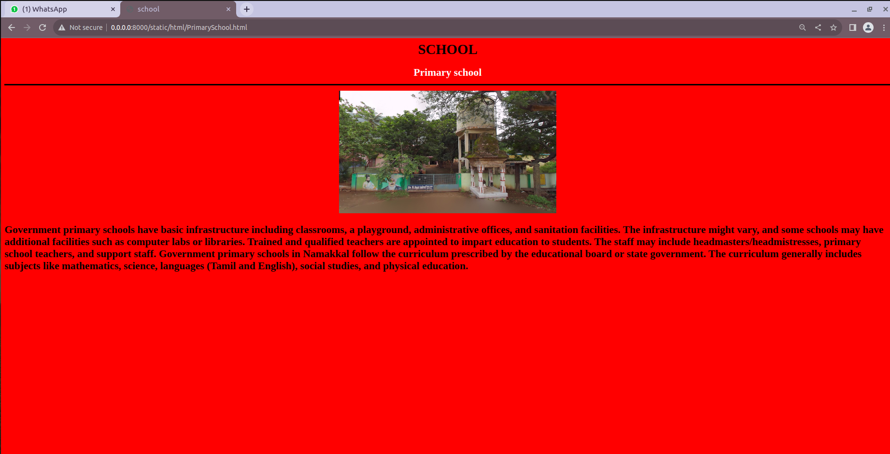
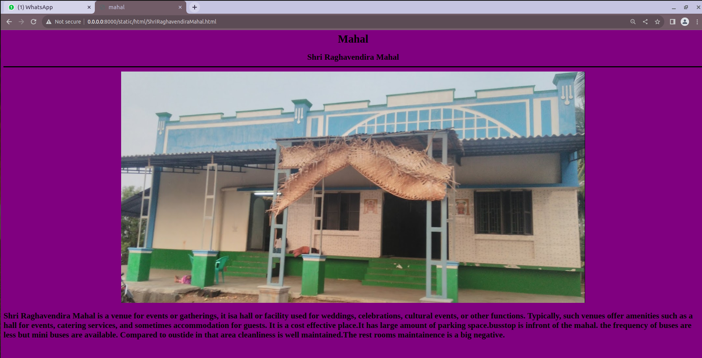
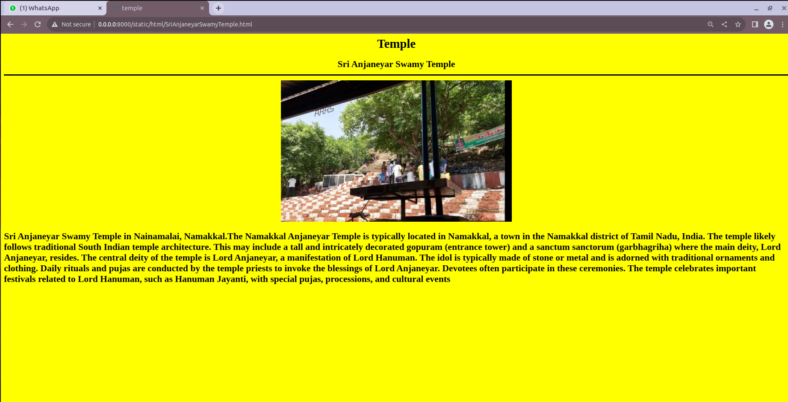

# Places Around Me
## AIM:
To develop a website to display details about the places around my house.

## Design Steps:

## Step 1:
Clone the github repository into the IDE

## Step 2:
Create a django project

## step 3:
Write the needed HTML code

## step 4:
Run the django server and excute the HTML files

## Code:
### map.html code:
```html
<!DOCTYPE html>
<html>
<head>
    <title>IMAGEMAPS DEMO</title>
</head>
<body>
    
    <map name="image_map">
        <area alt="SriAnjaneyarSwamyTemple" title="SriAnjaneyarSwamyTemple" href="SriAnjaneyarSwamyTemple.html" coords="411,18,428,41" shape="rect">
        <area alt="ShrinivasaMahal" title="ShrinivasaMahal" href="ShrinivasaMahal.html" coords="555,296,580,327" shape="rect">
        <area alt="KMSThirumanaMandabam" title="KMSThirumanaMandabam" href="KMSThirumanaMandabam.html" coords="564,644,33" shape="circle">
        <area alt="ShriRaghavendiraMahal" title="ShriRaghavendiraMahal" href="ShriRaghavendiraMahal.html" coords="831,710,33" shape="circle">
        <area alt="PrimarySchool" title="PrimarySchool" href="PrimarySchool.html" coords="171,804,26" shape="circle">
    </map>
</body>
</html>
```
### shrinivasamahal.html code:
```html
<html>
<head>
<title>mahal</title>
</head>
<body bgcolor="green">
<h1 align="center">
<font color="black"><b>Mahal</b></font>
</h1>
<h2 align="center">
<font color="black">Shrinivasa Mahal</font>
<hr size="3" color="black">

<p align="justify">
<font face="Shrinivasa Mahal" size="5">
<font color="black">
<h3>
<font color="black">
    Shrinivasa Mandabam is a popular wedding venue in Namakkal, Tamil Nadu. It is located on the Salem-Namakkal Road.
    Shrinivasa Mandabam has a spacious hall that can accommodate up to 1000 guests, and a dining hall that can serve up to 300 people. 
    The mandapam also has a generator backup, a car parking area, and a bridal room. 
    Shrinivasa Mandabam is known for its elegant decor, friendly staff, and affordable rates. Many couples have chosen this mandapam for their wedding ceremonies and receptions.
</font>    
</h3>
</font>
</p>
</body>
</html>
```
### KMSThirumanaMandabam.html code:
```html
<html>
<head>
<title>KMS </title>
</head>
<body bgcolor="blue">
<h1 align="center">
<font color="black"><b>Mandabam</b></font>
</h1>
<h2 align="center">
<font color="black">KMS thirumana Mandabam</font>
<hr size="3" color="black">

<p align="justify">
<font face="KMS Thirumana Mandabam" size="5">
<font color="black">
<h3>
<font color="black">
    Wedding hall were spacious and well-designed for a large number of guests.
        The layout typically includes a main hall for the ceremony and reception, as well as additional spaces such as a foyer, bridal suite, and sometimes outdoor areas for ceremonies or photo sessions.
        Wedding halls are often decorated in a neutral or elegant style to provide a versatile baor the event.
    ckdrop for various wedding themes and color schemes.
        The ambiance is carefully curated to create a romantic and festive atmosphere, with features such as chandeliers, drapery, and floral arrangements.
        Wedding halls are equipped with facilities such as a stage for the couple, a dance floor, and audio-visual equipment for speeches, presentations, and entertainment.
        It has  also offer catering services or have partnerships with catering companies to provide food
</font>  
</h3>
</font>
</p>
</body>
</html>
```
### PrimarySchool.html code:
```html
<html>
<head>
<title>school</title>
</head>
<body bgcolor="red">
<h1 align="center">
<font color="black"><b>SCHOOL</b></font>
</h1>
<h2 align="center">
<font color="white">Primary school</font>
<hr size="3" color="black">

<p align="justify">
<font face="Primary school" size="5">
<font color="black">
<h3>
<font color="black">
    Government primary schools have basic infrastructure including classrooms, a playground, administrative offices, and sanitation facilities.
        The infrastructure might vary, and some schools may have additional facilities such as computer labs or libraries.
        Trained and qualified teachers are appointed to impart education to students.
        The staff may include headmasters/headmistresses, primary school teachers, and support staff.
        Government primary schools in Namakkal follow the curriculum prescribed by the educational board or state government.
        The curriculum generally includes subjects like mathematics, science, languages (Tamil and English), social studies, and physical education.
</font>    
</h3>
</font>
</p>
</body>
</html>
```
### Shri Raghavendira Mahal.html code:
```html
<html>
<head>
<title>mahal</title>
</head>
<body bgcolor="purple">
<h1 align="center">
<font color="black"><b>Mahal</b></font>
</h1>
<h2 align="center">
<font color="black">Shri Raghavendira Mahal</font>
<hr size="3" color="black">

<p align="justify">
<font face="Shri Raghavendira Mahal" size="5">
<font color="black">
<h3>
<font color="black">
    Shri Raghavendira Mahal is a venue for events or gatherings, it isa hall or facility used for weddings, celebrations, cultural events, or other functions. Typically, such venues offer amenities such as a hall for events, catering services, and sometimes accommodation for guests.
    It is a cost effective place.It has large amount of parking space.busstop is infront of the mahal.
    the frequency of buses are less but mini buses are available.
    Compared to oustide in that area cleanliness is well maintained.The rest rooms maintainence is a big negative.
</font>    
</h3>
</font>
</p>
</body>
</html>
```
### SriAnjaneyarSwamyTemple.html code:
```html
<html>
<head>
<title>temple</title>
</head>
<body bgcolor="yellow">
<h1 align="center">
<font color="black"><b>Temple</b></font>
</h1>
<h2 align="center">
<font color="black">Sri Anjaneyar Swamy Temple</font>
<hr size="3" color="black">

<p align="justify">
<font face="Sri Anjaneyar Swamy Temple" size="5">
<font color="black">
<h3>
<font color="black">
    Sri Anjaneyar Swamy Temple in Nainamalai, Namakkal.The Namakkal Anjaneyar Temple is typically located in Namakkal, a town in the Namakkal district of Tamil Nadu, India.
    The temple likely follows traditional South Indian temple architecture. This may include a tall and intricately decorated gopuram (entrance tower) and a sanctum sanctorum (garbhagriha) where the main deity, Lord Anjaneyar, resides.
    The central deity of the temple is Lord Anjaneyar, a manifestation of Lord Hanuman. The idol is typically made of stone or metal and is adorned with traditional ornaments and clothing.
    Daily rituals and pujas are conducted by the temple priests to invoke the blessings of Lord Anjaneyar. Devotees often participate in these ceremonies.
    The temple celebrates important festivals related to Lord Hanuman, such as Hanuman Jayanti, with special pujas, processions, and cultural events
</font>    
</h3>
</font>
</p>
</body>
</html>
```
## Output:
### map output:

### Shrinivasa Mahal output:

### KMS mahal output:

### Primary school output:

### Shri Raghavendira Mahal output:

### Sri Anjaneyar Temple output:


## Result:
This program is successfully executed.